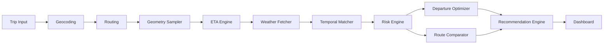

# StormRoute

**Know the weather before it reaches the road.**

Weather-aware road-trip intelligence: real road geometry × estimated arrival time × hourly forecast, with an explainable risk model and departure optimization.

StormRoute goes beyond a destination forecast. It evaluates the weather a driver may encounter along a real route, compares nearby departures, and evaluates practical route alternatives returned by the routing provider. No AI API, paid mapping key, database, or fabricated live data.

> A planning tool with an uncalibrated informational heuristic—not an official safety or navigation advisory.

## Demo & screenshots

Run locally at [localhost:3000](http://localhost:3000). Try **Ann Arbor, MI → Chicago, IL** for tomorrow. The map, timeline, route alternatives, and departure chart all use actual provider responses. The hero's route artwork is clearly labeled conceptual.

Screenshot capture frames are prepared in [docs/screenshots.md](docs/screenshots.md). Live deployment status is recorded separately after it is tested; this README does not claim that deployment alone verifies the APIs.

## Why StormRoute?

A forecast for Chicago cannot tell you whether wind or snow will affect the middle of a drive from Michigan. StormRoute aligns route positions with estimated arrival times, so the analysis follows the traveler instead of showing a handful of unrelated city forecasts.

## Features

- Real geocoding and driving geometry, with practical provider-returned alternatives.
- Distance-based route sampling; haversine calculations, cumulative lengths, edge interpolation, and clipped road geometry for risk coloring.
- ETA-aware hourly forecast matching with explicit missing-data handling.
- Six continuous weather-risk components, a dominant-hazard floor, and distance-weighted exposure statistics.
- Up to six departure windows evaluated using reused geometry and forecast timelines.
- Route utility balancing modeled weather risk and added travel time.
- Leaflet map, sample popups, departure chart, weather timeline, risk breakdown, and highest-risk locations.
- Bounded TTL caches, in-flight request coalescing, multi-coordinate weather batches, controlled concurrency, pacing, and request budgets.
- Typed errors, response validation, timeouts, production input limits, and a health endpoint.
- Responsive dark interface, labeled inputs, keyboard-operable controls, text equivalents to map data, and reduced-motion support.

## How it works



## Architecture

Pure domain logic lives in `src/lib`, presentation in `src/components`, and thin HTTP adapters in `src/app/api`. Provider-specific JSON is runtime-validated and normalized before entering the pipeline. There is no business logic in the map or chart components.

See [architecture.md](docs/architecture.md) for module boundaries, data flow, concurrency, complexity choices, and deployment limits.

## Spatiotemporal weather matching

For each sample, StormRoute combines a **route coordinate**, an **estimated arrival instant**, and a **forecast timeline**. Samples use real geographic distance rather than every Nth vertex. ETA is proportional to progress and the routing provider's duration. The nearest hourly observation is selected within a 30-minute tolerance, with no extrapolation.

The UI accepts the device's local departure time; the server canonicalizes it to UTC. Result times use the origin's timezone. Missing forecasts stay missing. A candidate with incomplete coverage cannot be scored or recommended.

## Risk model

Rain, snow, sustained wind/gusts, nonlinear visibility, wet/cold conditions, and storm/freezing-precipitation codes become normalized components. Correlated signals are constrained rather than blindly added. A dominant extreme hazard cannot disappear under other clear conditions.

The route combines distance-weighted average risk, maximum sample risk, and high-risk exposure. It also reports severe exposure and forecast coverage. Every final score is bounded to 0–100. All formulas, weights, assumptions, and known shortcomings are in [risk-model.md](docs/risk-model.md); tunable parameters live in `risk-config.ts`.

## Departure optimization

Offsets of −6, −3, 0, +3, +6, and +9 hours reuse the same geometry and cached hourly timelines. Past/out-of-window candidates are filtered and incomplete forecasts excluded. Equal-risk ties prefer the requested time. Selecting an already-computed departure updates the map and timeline without refetching weather.

## Route alternatives

OSRM may return alternatives; none are invented. Up to three routes within 35% of fastest are evaluated. The comparison at the selected departure uses `risk + 20 × (duration / fastestDuration − 1)`. Departure recommendations are then reported for the chosen route. This is a documented product tradeoff, not a claim of global optimality or safe driving.

## Caching

Geocoding: 24 hours. Routing: 1 hour. Weather: 10 minutes. Caches are bounded and share in-flight loads. Weather batches contain at most 12 locations, processed with two workers and paced starts. The same forecast timelines support every departure candidate. Diagnostics distinguish HTTP requests from locations and cache hits from misses.

Caches, quotas, and gates are per process. They reset on restart and are not distributed. Warm benchmark numbers below are not promises of serverless or browser latency.

## Reliability

Server-side Zod validation rejects bad city inputs, equal locations, malformed timestamps, and unsupported dates. Geographic equality is also checked after geocoding. Fixed provider hosts and encoded query parameters prevent user-directed outbound URLs. Provider calls abort after 15 seconds. Failed weather batches yield unknown observations, not low scores. Production responses exclude development diagnostics.

## Testing

```sh
npm run lint
npm run test
npm run test:coverage
npm run build
npm run benchmark
npx tsx scripts/manual-checks.ts # production server running on port 3000
```

**82 passing tests across 3 files; 98.5% domain-line coverage (329/334 lines), 94.02% branch coverage.** Coverage excludes presentation-only formatting and type declarations; it does not measure React UI coverage.

Vitest exercises geometry, ETA, temporal alignment, component scoring, score bounds, exposure weighting, optimization, TTL expiry, in-flight reuse, request budgets, concurrency, input validation, provider failures, and pipeline reuse. One invariant test evaluates 1,500 deterministic weather combinations; those are not counted as separate tests. Unit fixtures are explicitly synthetic and never enter the app's live data path.

Live HTTP checks cover the three example routes, a short Ann Arbor → Ypsilanti trip, an invalid city, identical endpoints, and a date outside the forecast horizon. Machine-readable results are in [docs/measurements](docs/measurements).

## Performance

The benchmark performs actual upstream analysis for four trips. Before each cold run it clears application caches, then immediately repeats the same request warm in the same process. It records stage timings, sample counts, route counts, departure windows, cache hits, and weather HTTP requests. This is a representative single cold/warm pair per trip, **not** a load test, statistically robust latency estimate, or measured batching-versus-sequential experiment.

Measured 2026-09-14T00:21:45.219Z using Node.js v24.21.0. Times are in-process analysis milliseconds.

| Route                          | Miles | Samples, all routes | Routes | Windows/route | Cold ms | Warm ms | Warm hits | Weather requests, cold → warm |
| ------------------------------ | ----: | ------------------: | -----: | ------------: | ------: | ------: | --------: | ----------------------------: |
| Ann Arbor, MI → Chicago, IL    |   240 |                  23 |      2 |             6 | 2994.02 |    2.73 |         5 |                         2 → 0 |
| Detroit, MI → Cleveland, OH    |   170 |                   8 |      1 |             6 | 1475.09 |    1.39 |         4 |                         1 → 0 |
| Chicago, IL → Indianapolis, IN |   180 |                   9 |      1 |             6 | 1492.88 |    1.33 |         4 |                         1 → 0 |
| Ann Arbor, MI → Columbus, OH   |   193 |                  18 |      2 |             6 | 2874.78 |    2.66 |         5 |                         2 → 0 |

Ann Arbor → Chicago sampled 11 positions on the primary route and 23 across both returned routes. Its measured cold-to-warm analysis-time reduction was 99.91%. The warm run made zero weather HTTP requests. These numbers include application-cache reuse and exclude HTTP transfer/rendering; upstream and network caches are not controlled.

[Raw benchmark JSON](docs/measurements/benchmark.json) · [HTTP verification](docs/measurements/manual-checks.json)

## Tech stack

Next.js · React · TypeScript (strict) · Tailwind CSS · Zod · Leaflet / React Leaflet · Recharts · Vitest · Lucide

No database: this product computes trips from public data and currently has no accounts or saved-trip requirement.

## Running locally

Requires Node.js 22 or newer; the recorded local run used Node.js 24.

```sh
npm install
npm run dev
```

For the production build, use `npm run build && npm start`. All default providers are keyless. `.npmrc` keeps package caches in this repo. Optional server-only `ROUTING_BASE_URL` replaces OSRM; `NEXT_PUBLIC_TILE_URL` replaces tiles and requires matching attribution changes. See [deployment.md](docs/deployment.md).

## Data sources & usage policy

- [Open-Meteo forecast and geocoding](https://open-meteo.com/en/terms): free API for non-commercial use, subject to published quotas; attribution under CC BY 4.0. Geocoding data credits [GeoNames](https://www.geonames.org/).
- [OSRM / FOSSGIS](https://routing.openstreetmap.de/about.html): public demo routing, maximum one request per second, no heavy usage or scraping; valid identification and attribution required.
- [OpenStreetMap](https://www.openstreetmap.org/copyright): road data and visible map attribution. [Tile usage policy](https://operations.osmfoundation.org/policies/tiles/) requires normal browser caching and attribution, and forbids bulk/offline prefetching.

Policies were checked September 13, 2026. The app identifies its server requests, paces routing, shows attribution, and fetches only visible map tiles. The default public infrastructure is suitable for a light portfolio demo, not an unlimited production backend. A scaled/multi-instance deployment needs coordinated rate limiting and an appropriate routing service. No paid service has been configured.

## Limitations

This heuristic is not calibrated against collisions or official road-safety outcomes. Forecasts are hourly, sampling is capped, and ETAs omit live traffic, stops, road treatment, vehicle type, and driver behavior. Small local hazards can fall between samples. External services may be unavailable. A lower score is not a guarantee that a route is safe. Check official alerts and road conditions before travel.

## Future work

Per-edge duration interpolation; calibrated uncertainty and hazard thresholds; official alert/closure overlays; shared cache/rate coordination before scaling; historical storm replay with real archive data; saved/shareable trips. These are future work, not implemented resume claims.

## Interview & repository polish

[Interview notes](docs/interview-notes.md) explain each engineering decision in plain language. [Verified summary](docs/verified-summary.md) contains measured resume-ready facts.

Suggested repository description: **Weather-aware route intelligence and departure-time optimization using geospatial forecast analysis.**

Applicable topics: `nextjs`, `typescript`, `geospatial`, `weather`, `routing`, `openstreetmap`, `optimization`, `data-visualization`.
