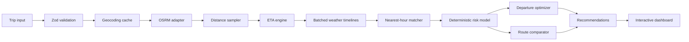

# Architecture

StormRoute separates pure geospatial computation from network adapters and presentation. The server owns validation, geocoding, routing, weather alignment, scoring, and recommendations. React receives normalized results and can switch already-computed departures without another API call.

## Boundaries

| Module            | Responsibility                                                                         |
| ----------------- | -------------------------------------------------------------------------------------- |
| `types.ts`        | Provider-independent domain contracts; longitude/latitude tuple order                  |
| `validation.ts`   | Zod trip validation, typed failures, fixed provider fetch policy                       |
| `providers.ts`    | Runtime response validation and geocoding, routing, weather adapters                   |
| `geometry.ts`     | Haversine, cumulative distance, interpolation, distance sampling, map segment clipping |
| `weather.ts`      | Time matching without inventing missing data                                           |
| `risk.ts`         | Six normalized components, dominant hazard floor, weighted exposure aggregation        |
| `optimization.ts` | Candidate departures, route/departure evaluation, deterministic comparison             |
| `cache.ts`        | Bounded TTL storage, in-flight coalescing, request pacing, bounded workers             |
| `budget.ts`       | Conservative minute/hour/day credit accounting within a process                        |
| `analyze.ts`      | Pipeline orchestration and request-scoped diagnostics                                  |
| `format.ts`       | U.S.-friendly display units and explicit time-zone formatting                          |

`POST /api/analyze` is a thin adapter with payload limits, capacity protection, and useful error responses. `GET /api/health` is a liveness check; it does not pretend to certify upstream availability. Runtime validation also applies to provider responses; TypeScript alone cannot establish that external JSON is valid.

## Geometry and ETA

The route adapter requests full GeoJSON and actual alternatives. Routes slower than 1.35 times the fastest are excluded; at most three are retained. A route is never synthesized from city endpoints.

Polyline edge lengths are computed using haversine distance. A prefix-distance array allows binary search for the edge containing each target distance. Linear interpolation inside that short edge yields a coordinate; interpolation handles longitude wrapping at the antimeridian. This is a local approximation, not a great-circle interpolator. The sample count is `min(23, max(2, ceil(geometryMeters / 40000))) + 1`, including both endpoints. This gives approximately 25-mile spacing until the 24-point cap. Long trips are coarser and explicitly described as such in the UI.

Geometry length sets the spatial progress fraction. Provider-reported road distance sets the displayed distance. Arrival is `departure + progress × providerDuration`. Stops, live congestion, and per-edge speeds are not modeled. Map segments preserve all underlying road vertices between midpoints of neighboring samples; the map does not replace winding roads with chords between samples.

## Space × time × forecast

All internal instants use ISO timestamps/Unix milliseconds. The input datetime is interpreted in the browser's device timezone and sent with an explicit offset, then canonicalized to UTC. Result times consistently use the origin's IANA timezone, including the destination ETA, with that convention disclosed in trip details.

The weather adapter retrieves eight days of hourly values at each sample. Matching chooses the nearest timestamp, ties favoring the later hour, with a maximum 30-minute difference and no extrapolation beyond either endpoint. This deliberately avoids pretending an hourly forecast has precise minute-level resolution. Precipitation is an hourly accumulation, while other fields may represent instantaneous conditions; this distinction limits the interpretation of nearest-hour matching.

## Reuse and concurrency

Origin and destination geocoding run concurrently. Route geometry is retrieved once per trip and reused across all candidate departures. Multi-coordinate weather batches contain up to 12 samples; two workers process batches, with starts paced at least 1.5 seconds apart in one process. An eight-day timeline is reused for all candidate ETAs. A 1.1-second serial gate limits OSRM requests to less than one start per second in the process.

Geocoding TTL: 24 hours, capacity 300. Routing TTL: 1 hour, capacity 300. Weather-batch TTL: 10 minutes, capacity 80. Keys are normalized city strings, serialized coordinate pairs, or date plus batch coordinates. Duplicate in-flight keys share one promise; failures are never cached as successes. Capacity eviction is FIFO, not LRU. Forecast timestamps are kept with cached values so their age remains visible.

A process-local budget counts one geocoding credit and one credit per weather location. Conservative ceilings are 450/minute, 4,500/hour, and 9,000/day. Upstream accounting can differ; these are protective application ceilings, not a promise of provider entitlement.

## Partial failures

A failed weather batch produces missing timelines only for that batch. An incomplete route/departure has a null score and cannot win optimization. Known portions remain visible, and exposure denominators are the entire route. Partial coverage never silently becomes clear weather. Routing/geocoding errors stop analysis with a useful message; stale forecasts are not silently substituted. Each network request has a 15-second abort timeout. The browser abandons analysis after 90 seconds and the hosted handler has a 60-second ceiling. There is no automatic retry storm.

## Scaling boundary

All caches, gates, quotas, and the two-analysis capacity limit are **process-local**. They are appropriate for local development and a lightly visited portfolio demo. Vercel can create several instances, so this implementation cannot enforce a deployment-wide upstream quota. Do not scale public FOSSGIS routing use with this design. Before increased traffic, replace the routing base with a service you operate or have permission to use and add shared rate coordination; a dedicated single process is another deployment option. No database was added simply for persistence that the product does not require.

## Diagnostics

Timers use `performance.now()` for geocoding, routing, sampling, weather, selected-departure risk, optimization, and total work. Counters cover geometry vertices, samples across routes, actual weather HTTP requests, and cache outcomes. They are attached to development responses or explicitly requested by the local benchmark script. Production responses exclude them. A cache hit includes in-flight coalescing; a weather HTTP request can contain multiple billable locations.
